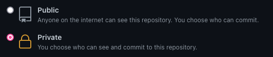

# test-frontend-developer
Faire un front-end en Vue.js sur la base d'une API de bars.

L'objectif de ce test est de développer une application Vue.js en respectant les objectifs suivants:
- L'application Web que vous devez developper doit être située dans le répertoire **client/** ([documentation](./client/README.md))
- L'application doit utiliser le json-server fourni dans le répertoire **server/** ([documentation](./server/README.md))

## Getting started

Pour débuter ce projet, nous vous demandons de cloner le repo et de ne pas publier votre travail à quelqu'un d'autre qu'à l'entreprise Unyc.
Pour cela nous vous conseillons de passer par la création via [ce lien](https://github.com/unyc-io/test-frontend-developer/generate).
Merci de mettre le projet généré en privé, comme visible ci-dessous :

L'utilisation de git ainsi que de github ou gitlab est obligatoire. Il faudra dans un premier temps :
- Créer une issue et une branche de développement
- Créer une pull/merge (selon github ou gitlab) request liée à la branche de développement, cette dernière permettera à l'équipe en charge de la review du test de suivre ton développement

Une version de node vous est conseillé dans le fichier [`.nvmrc`](./.nvmrc) pour s'assurer du bon fonctionnement du server d'API.

Les objectifs de développement qui sont attendues sont précisés dans la documentation [client](./client/README.md) et une documentation de l'API est disponible [ici](./server/README.md) en complément de l'outil [json-server](https://github.com/typicode/json-server#table-of-contents).

## Authors
dev@unyc.io

*Merci de respecter la confidentialité de ce test et de ne pas le diffuser*.
